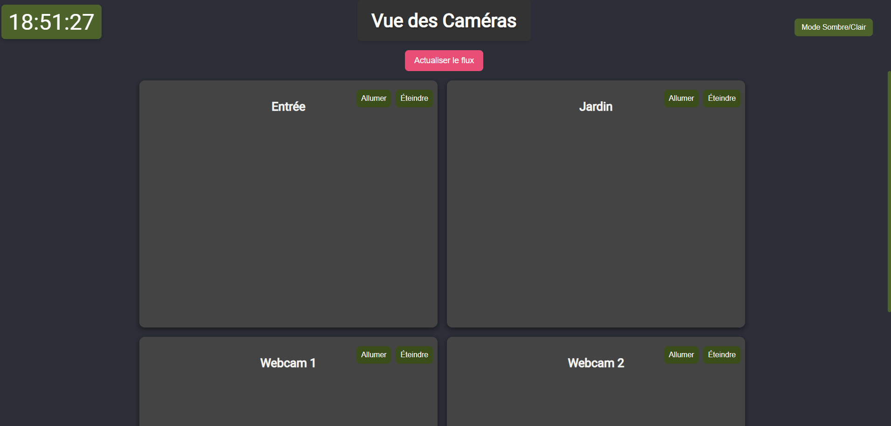

# Camera View

This project allows you to view real-time video streams from multiple cameras. It also provides options to turn the cameras on/off and refresh the streams at any time. The interface is responsive and supports dark mode.

## Features

- Real-time viewing of multiple cameras via iframes.
- Controls to turn each camera on/off.
- Button to refresh the video streams.
- Dark/Light mode toggle.
- Current time display.
- Responsive interface (works on mobile and desktop).

## Installation

1. Clone the repository or download the HTML file.
2. Place it in a directory accessible via your web server, or open it directly in your browser.
3. Make sure the camera URLs (iframe sources) are correct for your network setup.

## Usage

- **Dark/Light mode**: Click the "Dark/Light Mode" button to toggle between the modes.
- **Camera Controls**: Click "Turn On" or "Turn Off" to control each camera. You can also refresh the streams with the "Reload" button.
- **Refresh Streams**: Click "Refresh Streams" to reload all video streams at once.
